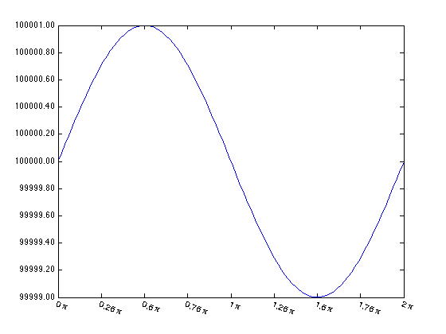

## tick2text.m Documentation

This function allows for more versatile labeling of axis ticks.  It
  offers two possible modifications: 
- automatic reformatting of tick
  labels based on a user-supplied format or function
- conversion of
  tick labels to text objects.
 
The first option simply offers a shortcut to manual reformatting via
  the [X/Y/Z]TickLabel properties of axes.  It also overrides the zoom/pan
  function of the axis so that ticks will update with your specified
  formatting as you zoom and pan.
 
  With the second option, the original tick labels are removed, and new
  text objects are created that mimic x, y, and/or z tick labels. The text
  object format allows more modification (such as color, rotation, etc)
  than the original tick labels, and also allows TeX strings to be utilized
  in tick labels (see xformat and yformat inputs for more details).

This function should be robust to all axis properties for 2D plots (i.e.
  log and linear, normal and reversed axis order, and left/right/top/bottom
  axis location).  This is also true in 3D, but it is not robust to
  rotation; if your axis is rotated such that the y-axis is to the left,
  ticks will not align properly.


**2014b Update**

Under Matlab 2014b or later, ticks now support rotation, latex
  formatting, etc.  So the text conversion option is now a bit obsolete.
  I've left it there for backward compatibility.  The non-conversion option
  remains applicable to all versions.

### Syntax

```
tick2text
tick2text(ax)
tick2text(ax, param1, val1, ...)
tick2text(ax, 'undo')
```
See function help for full description of input and output variables

### Example

 We'll begin with a simple sine wave, with an amplitude of 1 but shifted
 to y=100000.

```matlab
x = linspace(0,2*pi);
y = sin(x) + 100000;

plot(x,y);
set(gca, 'xtick', 0:pi/4:2*pi, 'xlim', [0 2*pi]);
```


 Because the y-axis values are large, Matlab's convention is to mark the
 ticks in scientific notation.  But in this case, that makes it impossible
 to distinguish between the values.  We can use tick2text to reformat the tick labels to a more readable format.  Also, let's show the x-tick
 labels as fractions of pi, and rotated.

```matlab
if ~verLessThan('matlab', '8.4.0')
    tick2text(gca, 'yformat', '.2f', ...
                   'xformat', @(x) sprintf('g\\pi', x/pi));

    set(gca, 'XTickLabelRotation', -20);
end
```
   
        

 In pre-2014b versions of Matlab, modifications such as TeX formatting and
 rotation of tick labels aren't allowed.  To get the proper result in
 these earlier Matlab versions, invoke the convert option for the x-axis
 ticks, which replaces the tick labels with text objects.

```matlab
if verLessThan('matlab', '8.4.0')
    tick2text(gca, 'yformat', '.2f', ...
                   'xformat', @(x) sprintf('g\\pi', x/pi), ...
                   'convert', [true false])
    set(getappdata(gca, 'XTickText'), 'rotation', -20, 'horiz', 'left');
end
```
           
 
